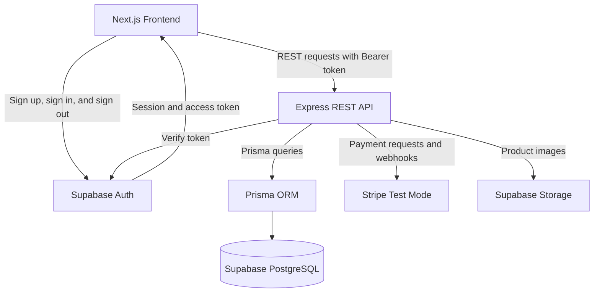

# Marcocenter      

> A full-stack PC hardware e-commerce platform built with Next.js, Express, and PostgreSQL.

## Team Members

| Team Member | Primary Contributions |
| --- | --- |
| `Yuefeng Xiao` | Project planning, UI/UX, frontend development, REST API development, database design, authentication and authorization, payment integration, testing, deployment, and documentation |
| `Candice` |documentation|


## Project Description

Marcocenter is a full-stack e-commerce application that sells PC hardware, including processors, graphics cards, motherboards, memory, storage devices, power supplies, cases, cooling products, and accessories.

The target customers are PC builders, gamers, students, and first-time buyers who want a clear way to find and compare computer components.

Many general online stores make it difficult to compare technical specifications or determine whether components are compatible. Marcocenter brings product discovery, specification filtering, stock information, compatibility guidance, secure test-mode checkout, order tracking, and account management into one application.

Marcocenter is differentiated by its focus on PC-building needs. In addition to standard e-commerce features, the planned platform includes hardware-specific filters and a basic compatibility checker for important relationships such as CPU socket, motherboard socket, memory type, and case form factor.

## Features

### Completed Features

The following project-planning work is complete:

#### Setup features

- Store concept and target audience defined
- Required technology stack selected
- Initial application architecture documented
- Initial feature scope documented
- GitHub-based development workflow defined
- Next.js frontend application initialized
- Express backend application initialized
- Prisma ORM configured with Supabase PostgreSQL
- Supabase Auth selected as the authentication provider
#### Customer features

- Responsive home page and navigation
- Product catalog with pagination
- Search by product name, brand, or keyword
- Filter by category, brand, price
- Product detail pages with images, descriptions, price, and stock status
- Supabase Auth registration, login, logout, password recovery, and protected account pages
- Persistent shopping cart
- Server-side price and inventory validation
- Stripe test-mode checkout
- Order confirmation and order history
- Loading, empty, validation, and error states
#### Administrator Features

- Role-protected administrator dashboard
- Create, update and deactivate products
- Manage categories, brands, product images, and descriptions
- Adjust inventory
- View and update customer order status
#### Engineering and Quality Features

- Request validation and centralized API error handling
- Authentication and role-based authorization
- Stripe webhook signature verification
- Database migrations and seed data
- API documentation
- Responsive and accessible interface
- Production deployment with separate frontend and backend applications

### Planned and Incomplete Features

#### Customer Features

- Compare specifications
- Product reviews and ratings
- Wishlist
- Basic PC-component compatibility guidance

#### Administrator Features
- review inventory history
- Low-stock alerts
- Sales, order, inventory, and best-selling-product analytics
- Administrator activity log

#### Engineering and Quality Features

- Unit, integration, and end-to-end tests

## Technology Stack

| Area | Technologies |
| --- | --- |
| Frontend | React, Next.js, TypeScript, Tailwind CSS |
| Backend | Node.js, Express.js, REST API |
| Database | PostgreSQL, Prisma ORM |
| Authentication | Supabase Auth, Supabase-issued JWT access tokens, Express authentication middleware |
| Payments | Stripe Test Mode and Stripe webhooks |
| Hosted services | Supabase PostgreSQL, Supabase Auth, Supabase Storage |

| Validation and utilities | Zod, CORS, Stripe SDK |

### Planned Stack and Incomplete Features

| Backend testing | Vitest and Supertest |
| Frontend/end-to-end testing | Vitest, Playwright |

## Application Architecture



The Next.js application is responsible for the user interface, navigation, client-side state, user input, loading states, displaying API responses, and maintaining the Supabase Auth session.

Supabase Auth is responsible for account creation, password handling, login, logout, session management, password recovery, and issuing access-token JWTs. The application does not store or hash user passwords itself.

The separate Express application exposes REST API routes. It validates incoming data, verifies Supabase access tokens, applies business rules, authorizes administrator actions, calculates trusted prices, checks inventory, communicates with Stripe, and reads from or writes to PostgreSQL through Prisma.

The frontend communicates directly with Supabase only for authentication. It does **not** directly access core business tables. Product, cart, inventory, order follow this path:

```text
Next.js frontend
        ↓ HTTPS requests, JSON responses, and optional Bearer token
Express REST API
        ↓ Prisma ORM
Supabase PostgreSQL
```

### Authentication and Authorization Flow

1. A user signs up or signs in through Supabase Auth.
2. Supabase returns a session containing an access token.
3. Next.js sends the access token to protected Express routes using `Authorization: Bearer <access-token>`.
4. Express authentication middleware verifies the token and attaches the verified user identity to the request.
5. Express applies resource ownership and role-based authorization rules before executing business operations.
6. Prisma reads or modifies the corresponding application data in the PostgreSQL `public` schema.

Supabase Auth answers **who the user is**. Express remains responsible for **what the user is allowed to do**. Administrator privileges, resource ownership, inventory changes, and order access are enforced by the Express API rather than trusted from frontend state.

## Repository Structure

```text
CISC3140_E-Commerce/
├── frontend/                         # Next.js frontend application
│   ├── public/                       # Static assets
│   │
│   ├── src/
│   │   ├── app/                      # Next.js App Router pages
│   │   │   ├── account/              # Customer account and profile pages
│   │   │   ├── admin/                # Administrator pages
│   │   │   ├── auth/                 # Authentication-related routes
│   │   │   ├── cart/                 # Shopping cart page
│   │   │   ├── checkout/             # Checkout flow
│   │   │   ├── login/                # Login page
│   │   │   ├── products/             # Product catalog and product details
│   │   │   ├── signup/               # Registration page
│   │   │   ├── globals.css           # Global styles
│   │   │   ├── layout.tsx            # Root application layout
│   │   │   └── page.tsx              # Home page
│   │   │
│   │   ├── components/               # Reusable React components
│   │   │   ├── account/
│   │   │   ├── auth/
│   │   │   ├── checkout/
│   │   │   ├── image/
│   │   │   ├── layout/
│   │   │   └── products/
│   │   │
│   │   ├── lib/                      # Frontend utilities and API helpers
│   │   │   ├── supabase/             # Supabase client utilities
│   │   │   ├── product.ts            # Product API helpers
│   │   │   ├── profile.ts            # Profile API helpers
│   │   │   └── uploadImage.ts        # Product image upload helper
│   │   │
│   │   └── proxy.ts                  # Next.js request proxy/middleware logic
│   │
│   ├── types/                        # Generated/supporting TypeScript types
│   ├── .env.example                  # Frontend environment variable template
│   ├── next.config.ts                # Next.js configuration
│   ├── package.json
│   └── tsconfig.json
│
├── backend/                          # Express REST API
│   ├── prisma/
│   │   ├── migrations/               # Database migration history
│   │   ├── schema.prisma             # Prisma database schema
│   │   └── seed.ts                   # Development seed data
│   │
│   ├── src/
│   │   ├── controllers/              # API request handlers and business logic
│   │   │   ├── adminOrderController.ts
│   │   │   ├── adminProductController.ts
│   │   │   ├── authController.ts
│   │   │   ├── cartController.ts
│   │   │   ├── checkoutController.ts
│   │   │   ├── orderController.ts
│   │   │   ├── productController.ts
│   │   │   ├── profileController.ts
│   │   │   └── stripeWebhookController.ts
│   │   │
│   │   ├── lib/                      # External service and database clients
│   │   │   ├── prisma.ts             # Prisma client
│   │   │   ├── stripe.ts             # Stripe client
│   │   │   └── supabase.ts           # Supabase server client
│   │   │
│   │   ├── middleware/               # Express middleware
│   │   │   ├── requireAdmin.ts       # Administrator authorization
│   │   │   ├── requireAuth.ts        # Authentication middleware
│   │   │   └── upload.ts             # Image upload middleware
│   │   │
│   │   ├── routes/                   # REST API route definitions
│   │   │   ├── adminRoutes.ts
│   │   │   ├── authRoutes.ts
│   │   │   ├── cartRoutes.ts
│   │   │   ├── checkoutRoutes.ts
│   │   │   ├── orderRoutes.ts
│   │   │   ├── productRoutes.ts
│   │   │   ├── profileRoutes.ts
│   │   │   └── index.ts
│   │   │
│   │   ├── types/
│   │   │   └── express.d.ts          # Custom Express TypeScript definitions
│   │   │
│   │   ├── app.ts                    # Express application configuration
│   │   └── server.ts                 # Backend server entry point
│   │
│   ├── .env.example                  # Backend environment variable template
│   ├── prisma.config.ts              # Prisma configuration
│   ├── package.json
│   └── tsconfig.json
│
├── packages/
│   └── shared/                       # Shared validation schemas
│       ├── src/
│       │   ├── checkoutSchema.ts      # Checkout validation
│       │   ├── productSchema.ts       # Product validation
│       │   ├── profileSchema.ts       # Profile validation
│       │   └── index.ts               # Shared package exports
│       ├── package.json
│       └── tsconfig.json
│
├── .gitignore
├── package.json                      # Root scripts and shared workspace setup
├── package-lock.json
└── README.md

## Project Management and Development Workflow

Development work is tracked in a GitHub Project rather than only in personal notes.

- **GitHub Project:** https://github.com/users/qiwuyue/projects/1
- **Repository:** https://github.com/qiwuyue/CISC3140_E-Commerce/
- **Workflow:** Backlog → Todo → In Progress → Done

### GitHub Project Fields

| Field | Example Values | Purpose |
| --- | --- | --- |
| Status | Backlog, Todo, In Progress, Done | Tracks the current stage of work |
| Priority | Low, Medium, High | Identifies critical, important, and optional work |


### Issue Workflow

1. Create a GitHub Issue for each feature, bug, test, or documentation task.
2. Assign the appropriate priority, size, area, and iteration.
3. Add the Issue to the GitHub Project and move it to **Todo** before development.
4. Create a branch from the latest `main` branch and move the Issue to **In Progress**.
5. Make focused, meaningful commits that reference the Issue when appropriate.
6. Open a pull request and link it with `Closes #<issue-number>` or move the Issue to **Done** in project board.
7. Confirm that automated checks pass and complete the pull-request checklist.
8. Request a code review. For an individual project, the instructor, teaching assistant, or an approved classmate will be asked to review milestone pull requests.
9. Merge the approved pull request and move the linked Issue to **Done**.


### Commit Examples

```text
docs: add initial project requirements
feat: add product list endpoint
feat: persist cart items for authenticated users
test: add login integration tests
fix: prevent checkout when stock is insufficient
chore: configure enviroment or files
```


## Vertical-Slice Example

### Vertical Slice 1: Product Catalog

#### Database Changes

- Add `categories`, `brands`, `products` tables
- Add product price, stock quantity, status.
- Add seed data for development and grading

#### API Routes

- `GET /api/products`
- `GET /api/products/:id`

#### Frontend Components and Services

- Product catalog page
- Product card
- Search and filter controls
- Product detail page
- Typed API client for product requests
- Loading, empty, and error states

#### Testing Plan

- Unit tests for product query validation
- Supertest integration tests for product routes
- Component tests for product cards and filters


## Local Installation

> The commands below describe the planned project setup. They will become executable after the frontend and backend applications are initialized.

### Prerequisites

- Node.js 20 or later
- npm
- Git
- A Supabase project with PostgreSQL and Auth enabled
- Stripe CLI

### 1. Clone the Repository

```bash
git clone https://github.com/qiwuyue/CISC3140_E-Commerce.git
cd CISC3140_E-Commerce
```

### 2. Install Root Dependencies and Build Shared Schemas
- zod(validator)
```bash
npm install
npm run build:shared
```

### 3. Install Frontend Dependencies

```bash
cd frontend
npm install
cd ..
```

### 4. Install Backend Dependencies

```bash
cd backend
npm install
cd ..
```

### 5. Configure Environment Variables

Create the required `.env` files and enter your local development values.

Backend environment variables include:

```env
DATABASE_URL=
DIRECT_URL=

SUPABASE_URL=
SUPABASE_PUBLISHABLE_KEY=
SUPABASE_SECRET_KEY=

STRIPE_SECRET_KEY=
STRIPE_WEBHOOK_SECRET=
```

Frontend environment variables include:

```env
BACKEND_API_URL=<backend-url>
NEXT_PUBLIC_BACKEND_API_URL=<backend-url>
NEXT_PUBLIC_SUPABASE_URL=
NEXT_PUBLIC_SUPABASE_PUBLISHABLE_KEY=
NEXT_PUBLIC_STRIPE_PUBLISHABLE_KEY=
```


### 6. Configure Supabase Storage

This project uses Supabase Storage for product images.

In the Supabase Dashboard:

1. Go to **Storage**.
2. Create a bucket named:

   `product-image`

3. Set the bucket to **Public**.
4. Configure:
   - Maximum file size: `5 MB`
   - Allowed MIME types:
     - `image/jpeg`
     - `image/png`
     - `image/webp`

The backend uploads product images to this bucket and stores the public image URL in the product record.

### 7. Prepare the Database
Get the database connection strings from your Supabase project settings.
Goto supabase project---Get connected---ORM---Prisma
Set `DATABASE_URL` and `DIRECT_URL` in `backend/.env`.

`DATABASE_URL` is used by the running Express application.

`DIRECT_URL` is used by Prisma CLI for migrations.

Run:

```bash
cd backend

npx prisma migrate deploy
npx prisma generate
npx prisma db seed

cd ..
```

### 8. Configure Stripe Test Environment

Generated a test secret key and configure a Stripe sandbox for local development.

```bash
cd backend
stripe sandbox create --from-git
cd ..
```

### 9. Start the Stripe Webhook Listener

In a separate terminal, keep the Stripe CLI listener running:
(Since terminal syntax can differ, the commands below use PowerShell.)
```bash
stripe listen \
  --events "payment_intent.succeeded,payment_intent.payment_failed" \
  --forward-to http://localhost:5000/api/webhooks/stripe
```

Copy the webhook signing secret generated by Stripe CLI into:

```env
STRIPE_WEBHOOK_SECRET=
```

in `backend/.env`.

### 10. Start the Express Backend

In a terminal:

```bash
cd backend
npm run dev
```

By default, the backend runs at:

```text
http://localhost:4000
```

### 11. Start the Next.js Frontend

In another terminal:

```bash
cd frontend
npm run dev
```

By defalut, the frontend runs at:

```text
http://localhost:3000
```

### 12. Run Tests (Ignored, Incompleted feature)

Backend tests:

```bash
cd backend
npm test
```

Frontend tests:

```bash
cd frontend
npm test
```

End-to-end tests:

```bash
cd frontend
npx playwright test
```

## Environment Variables

Only variable names and example placeholders belong in Git. Real credentials must remain in local or deployment-platform environment settings.

### Frontend: `frontend/.env.local`

| Variable | Purpose |
| --- | --- |
| `NEXT_PUBLIC_BACKEND_API_URL` | Base URL of the Express REST API |
| `NEXT_PUBLIC_SUPABASE_URL` | Public Supabase project URL used by the frontend authentication client |
| `NEXT_PUBLIC_SUPABASE_PUBLISHABLE_KEY` | Public Supabase key used by the frontend authentication client |
| `NEXT_PUBLIC_STRIPE_PUBLISHABLE_KEY` | Stripe test-mode publishable key used by the frontend checkout flow |

### Backend: `backend/.env`

| Variable | Purpose |
| --- | --- |
| `DATABASE_URL` | PostgreSQL runtime connection used by Express and Prisma Client |
| `DIRECT_URL` | Supabase Session Pooler connection used by Prisma CLI and migrations |
| `SUPABASE_URL` | Supabase project URL |
| `SUPABASE_PUBLISHABLE_KEY` | Supabase publishable key used for authentication |
| `SUPABASE_SECRET_KEY` | Server-only Supabase key used for privileged operations such as product image uploads |
| `STRIPE_SECRET_KEY` | Stripe test-mode secret key |
| `STRIPE_WEBHOOK_SECRET` | Secret used to verify Stripe webhook signatures |

Example local configuration:

```env
NEXT_PUBLIC_BACKEND_API_URL=http://localhost:4000
NEXT_PUBLIC_SUPABASE_URL=
NEXT_PUBLIC_SUPABASE_PUBLISHABLE_KEY=
NEXT_PUBLIC_STRIPE_PUBLISHABLE_KEY=
```


## API Documentation

### Public APIs

| Method | Endpoint | Description |
|---|---|---|
| `GET` | `/api/products` | Get products with search, sorting, and pagination |
| `GET` | `/api/products/:slug` | Get product details by slug |

### Authentication

| Method | Endpoint | Description |
|---|---|---|
| `GET` | `/api/auth/me` | Verify the current authenticated user |

Protected routes require a Supabase access token:

```text
Authorization: Bearer <access-token>
```

### Profile

| Method | Endpoint | Description |
|---|---|---|
| `POST` | `/api/profile/init` | Initialize user profile |
| `GET` | `/api/profile` | Get current user profile |
| `PATCH` | `/api/profile` | Update current user profile |

### Cart

| Method | Endpoint | Description |
|---|---|---|
| `GET` | `/api/cart` | Get current user's cart |
| `POST` | `/api/cart/items` | Add a product to the cart |
| `PATCH` | `/api/cart/items/:id` | Update cart item quantity |
| `DELETE` | `/api/cart/items/:id` | Remove an item from the cart |

### Checkout & Orders

| Method | Endpoint | Description |
|---|---|---|
| `POST` | `/api/checkout` | Create an order and Stripe PaymentIntent |
| `GET` | `/api/orders` | Get current user's order history |
| `GET` | `/api/orders/:id` | Get order details |

### Admin Products

Admin routes require an authenticated user with the `ADMIN` role.

| Method | Endpoint | Description |
|---|---|---|
| `GET` | `/api/admin/check` | Verify admin access |
| `GET` | `/api/admin/products` | Get products for admin management |
| `GET` | `/api/admin/products/:id` | Get a product by ID |
| `GET` | `/api/admin/product-options` | Get available categories and brands |
| `POST` | `/api/admin/products` | Create a product |
| `PATCH` | `/api/admin/products/:id` | Update a product |
| `POST` | `/api/admin/products/:id/image` | Upload a product image |

### Admin Orders

| Method | Endpoint | Description |
|---|---|---|
| `GET` | `/api/admin/orders` | Get customer orders |
| `GET` | `/api/admin/orders/:id` | Get order details |
| `PATCH` | `/api/admin/orders/:id/status` | Update order status |

### Stripe Webhook

| Method | Endpoint | Description |
|---|---|---|
| `POST` | `/api/webhooks/stripe` | Handle Stripe payment events |

The webhook currently handles successful and failed Stripe PaymentIntent events and updates order, payment, cart, and inventory data accordingly.

## Database Design

The application uses PostgreSQL hosted by Supabase and Prisma ORM for database access.

| Table | Purpose |
|---|---|
| Supabase `auth.users` | Stores authentication identities and credentials managed by Supabase Auth |
| `profiles` | Stores customer profile information and user roles |
| `categories` | Stores product categories |
| `brands` | Stores product manufacturers |
| `products` | Stores product details, price, stock, image, category, and brand |
| `Cart` | Stores one shopping cart for each user |
| `CartItem` | Stores products and quantities inside a cart |
| `orders` | Stores customer orders, shipping information, totals, payment status, and Stripe PaymentIntent references |
| `order_items` | Stores product snapshots and quantities for each order |

### Relationships

- A product belongs to one category and one brand.
- A profile has one cart and can have many orders.
- A cart contains many cart items.
- An order contains many order items.
- Product prices and order totals use PostgreSQL `DECIMAL(10,2)` values.
- Authentication credentials are managed by Supabase Auth and are not stored in Prisma-managed tables.

## Screenshots

Screenshots will be added after the corresponding pages are implemented.

Planned screenshots:

- Home page
  
- Product catalog and filters
  
- Product detail page
  
- Shopping cart
  
- Stripe test checkout and order confirmation
  
  
- Customer order history
  
- Administrator product and inventory management


## Known Issues and Current Limitations

- Automated unit, integration, and end-to-end test coverage is still incomplete.
- The application has not yet been deployed to a production environment.
- Product image management currently supports only one image per product.
- Some administrator pages may require additional responsive UI improvements for smaller screens.
- Advanced features such as product reviews, wishlists, hardware compatibility checking, and analytics are not currently implemented.

## Future Improvements

- Add unit, integration, and Playwright end-to-end tests.
- Deploy the frontend and backend to production environments.
- Support multiple product images and improved product image management.
- Support rich-text description and specifications comparator.
- Improve responsive design across customer and administrator pages.
- Add advanced product filtering and PC hardware compatibility checking.
- Add product reviews, wishlists, low-stock alerts, and administrator analytics.

