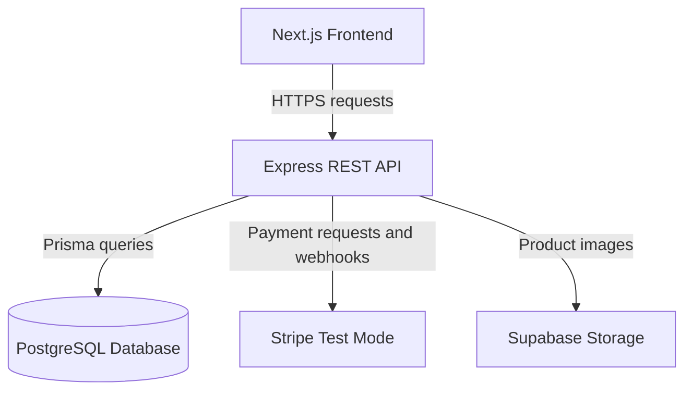

# Marcocenter      

> A full-stack PC hardware e-commerce platform built with Next.js, Express, and PostgreSQL.

## Project Status

Marcocenter is currently in the planning and project-setup stage. Application features listed under **Planned or Incomplete Features** have not yet been completed. This README will be updated throughout development so that the documented status matches the working application.

## Team Members

| Team Member | Role | Primary Contributions |
| --- | --- | --- |
| `Yuefeng Xiao` | Full-Stack Developer | Project planning, UI/UX, frontend development, REST API development, database design, authentication and authorization, payment integration, testing, deployment, and documentation |

This project is currently planned as an individual project. The development process will still use GitHub Issues, a GitHub Project board, feature branches, pull requests, code reviews, and meaningful commits.

## Project Description

Marcocenter is a full-stack e-commerce application that sells PC hardware, including processors, graphics cards, motherboards, memory, storage devices, power supplies, cases, cooling products, and accessories.

The target customers are PC builders, gamers, students, and first-time buyers who want a clear way to find and compare computer components.

Many general online stores make it difficult to compare technical specifications or determine whether components are compatible. Marcocenter brings product discovery, specification filtering, stock information, compatibility guidance, secure test-mode checkout, order tracking, and account management into one application.

Marcocenter is differentiated by its focus on PC-building needs. In addition to standard e-commerce features, the planned platform includes hardware-specific filters and a basic compatibility checker for important relationships such as CPU socket, motherboard socket, memory type, and case form factor.

## Features

### Completed Features

No customer-facing or administrator-facing application features have been completed yet.

The following project-planning work is complete:

- Store concept and target audience defined
- Required technology stack selected
- Initial application architecture documented
- Initial feature scope documented
- GitHub-based development workflow defined

### Planned or Incomplete Features

#### Customer Features

- Responsive home page and navigation
- Product catalog with pagination
- Search by product name, brand, or keyword
- Filter by category, brand, price, availability, and hardware specifications
- Product detail pages with images, specifications, price, and stock status
- User registration, login, logout, and protected account pages
- Persistent shopping cart
- Server-side price and inventory validation
- Stripe test-mode checkout
- Order confirmation and order history
- Product reviews and ratings
- Wishlist
- Loading, empty, validation, and error states
- Basic PC-component compatibility guidance

#### Administrator Features

- Role-protected administrator dashboard
- Create, update, deactivate, and delete products
- Manage categories, brands, product images, and specifications
- Adjust inventory and review inventory history
- Low-stock alerts
- View and update order status
- View customers and account roles
- Sales, order, inventory, and best-selling-product analytics
- Administrator activity log

#### Engineering and Quality Features

- Request validation and centralized API error handling
- Authentication and role-based authorization
- Stripe webhook signature verification
- Database migrations and seed data
- Unit, integration, and end-to-end tests
- API documentation
- Responsive and accessible interface
- Production deployment with separate frontend and backend applications

## Technology Stack

| Area | Technologies |
| --- | --- |
| Frontend | React, Next.js, TypeScript, Tailwind CSS |
| Backend | Node.js, Express.js, REST API |
| Database | PostgreSQL, Prisma ORM |
| Authentication | JSON Web Tokens (JWT), bcrypt, secure HTTP-only cookies |
| Payments | Stripe Test Mode and Stripe webhooks |
| Frontend deployment | Vercel |
| Backend deployment | Render |
| Hosted database and image storage | Supabase PostgreSQL |
| Backend testing | Vitest and Supertest |
| Frontend/end-to-end testing | Vitest, Playwright |
| Validation and utilities | Zod, CORS, Stripe SDK |


## Application Architecture



The Next.js application is responsible for the user interface, navigation, client-side state, user input, loading states, and displaying API responses.

The separate Express application exposes REST API routes. It validates incoming data, applies business rules, authenticates users, authorizes administrator actions, calculates trusted prices, checks inventory, communicates with Stripe, and reads from or writes to PostgreSQL through Prisma.

The frontend does **not** directly access the database. Core application data follows this path:

```text
Next.js frontend
        ↓ HTTPS requests and JSON responses
Express REST API
        ↓ Prisma ORM
PostgreSQL database
```

## Planned Repository Structure

```text
Marcocenter/
├── frontend/                 # Next.js application
│   ├── app/
│   ├── components/
│   ├── lib/
│   └── package.json
├── backend/                  # Separate Express application
│   ├── prisma/
│   │   ├── schema.prisma
│   │   └── seed.ts
│   ├── src/
│   │   ├── controllers/
│   │   ├── middleware/
│   │   ├── routes/
│   │   ├── services/
│   │   ├── validators/
│   │   └── server.ts
│   └── package.json
├── docs/
├── .github/
└── README.md
```

## Project Management and Development Workflow

Development work is tracked in a GitHub Project rather than only in personal notes.

- **GitHub Project:** `[Add GitHub Project URL]`
- **Repository:** `[Add GitHub repository URL]`
- **Workflow:** Backlog → Ready → In Progress → In Review → Done

### GitHub Project Fields

| Field | Example Values | Purpose |
| --- | --- | --- |
| Status | Backlog, Ready, In Progress, In Review, Done | Tracks the current stage of work |
| Priority | P0, P1, P2 | Identifies critical, important, and optional work |
| Size | S, M, L | Estimates task complexity |
| Area | Frontend, Backend, Database, Testing, Documentation, DevOps | Groups work by technical area |
| Iteration | Week 1, Week 2, Week 3, etc. | Tracks weekly progress |

### Issue Workflow

1. Create a GitHub Issue for each feature, bug, test, or documentation task.
2. Add acceptance criteria and assign the appropriate priority, size, area, and iteration.
3. Add the Issue to the GitHub Project and move it to **Ready** before development.
4. Create a branch from the latest `main` branch and move the Issue to **In Progress**.
5. Make focused, meaningful commits that reference the Issue when appropriate.
6. Open a pull request and link it with `Closes #<issue-number>`.
7. Confirm that automated checks pass and complete the pull-request checklist.
8. Request a code review. For an individual project, the instructor, teaching assistant, or an approved classmate will be asked to review milestone pull requests.
9. Merge the approved pull request and move the linked Issue to **Done**.

### Branch Naming

```text
setup/frontend
setup/backend
feature/product-catalog
feature/authentication
feature/shopping-cart
feature/checkout
feature/admin-dashboard
fix/<short-description>
docs/<short-description>
test/<short-description>
```

### Commit Examples

```text
docs: add initial project requirements
feat(products): add product list endpoint
feat(cart): persist cart items for authenticated users
test(auth): add login integration tests
fix(inventory): prevent checkout when stock is insufficient
```

### Definition of Done

A task may be moved to **Done** only when:

- Its acceptance criteria are satisfied
- The implementation has been manually verified
- Relevant tests have been added or updated
- Existing tests pass
- Loading, empty, validation, and error states are handled where applicable
- No secrets or generated files are committed
- Documentation is updated when behavior or setup changes
- The pull request has been reviewed and merged

## Vertical-Slice Examples

The course requires at least two **completed** vertical slices. The sections below identify the first two planned slices, but they will not be marked complete until the database, API, frontend, and tests all work together.

### Vertical Slice 1: Product Catalog — Planned

#### Database Changes

- Add `categories`, `brands`, `products`, and `product_images` tables
- Add product price, stock quantity, status, and searchable specification data
- Add seed data for development and grading

#### API Routes

- `GET /api/products`
- `GET /api/products/:id`
- `GET /api/categories`

#### Frontend Components and Services

- Product catalog page
- Product card
- Search and filter controls
- Product detail page
- Typed API client for product requests
- Loading, empty, and error states

#### Testing Plan

- Unit tests for product query validation
- Supertest integration tests for product routes
- Component tests for product cards and filters
- Playwright test for browsing from the catalog to a product page

### Vertical Slice 2: Shopping Cart — Planned

#### Database Changes

- Add `carts` and `cart_items` tables
- Add user, product, quantity, and uniqueness relationships

#### API Routes

- `GET /api/cart`
- `POST /api/cart/items`
- `PATCH /api/cart/items/:itemId`
- `DELETE /api/cart/items/:itemId`

#### Frontend Components and Services

- Add-to-cart control
- Cart page or cart drawer
- Quantity controls and remove action
- Cart API service and client-side synchronization
- Price summary, loading, empty, and error states

#### Testing Plan

- Unit tests for quantity and stock validation
- Supertest integration tests for authenticated cart routes
- Component tests for quantity controls and totals
- Playwright test for adding, updating, and removing a cart item

After each slice is completed, this section will be updated with the exact migration names, implemented files, request and response behavior, test commands, and test results.

## Local Installation

> The commands below describe the planned project setup. They will become executable after the frontend and backend applications are initialized.

### Prerequisites

- Node.js 20 or later
- npm
- Git
- A PostgreSQL database or Supabase PostgreSQL project
- A Stripe test account for checkout development

### 1. Clone the Repository

```bash
git clone <repository-url>
cd Marcocenter
```

### 2. Install Frontend Dependencies

```bash
(cd frontend && npm install)
```

### 3. Install Backend Dependencies

```bash
(cd backend && npm install)
```

### 4. Configure Environment Variables

Create local environment files from the example files:

```bash
cp frontend/.env.example frontend/.env.local
cp backend/.env.example backend/.env
```

Enter local development values for the variables listed in the **Environment Variables** section. Never commit real secret values.

### 5. Connect to PostgreSQL and Prepare the Database

Set `DATABASE_URL` in `backend/.env`, then run:

```bash
(cd backend && npx prisma migrate dev && npx prisma db seed)
```

### 6. Start the Express Backend

```bash
(cd backend && npm run dev)
```

The backend is planned to run at `http://localhost:5000`.

### 7. Start the Next.js Frontend

In another terminal:

```bash
(cd frontend && npm run dev)
```

The frontend is planned to run at `http://localhost:3000`.

### 8. Run Tests

Backend tests:

```bash
(cd backend && npm test)
```

Frontend tests:

```bash
(cd frontend && npm test)
```

End-to-end tests:

```bash
(cd frontend && npx playwright test)
```

## Environment Variables

Only variable names and example placeholders belong in Git. Real credentials must remain in local or deployment-platform environment settings.

### Frontend: `frontend/.env.local`

| Variable | Purpose |
| --- | --- |
| `NEXT_PUBLIC_API_URL` | Base URL of the Express REST API |
| `NEXT_PUBLIC_STRIPE_PUBLISHABLE_KEY` | Stripe test-mode publishable key |

### Backend: `backend/.env`

| Variable | Purpose |
| --- | --- |
| `NODE_ENV` | Current runtime environment |
| `PORT` | Express server port |
| `DATABASE_URL` | PostgreSQL connection string used by Prisma |
| `FRONTEND_URL` | Allowed frontend origin for CORS |
| `JWT_SECRET` | Secret used to sign authentication tokens |
| `JWT_EXPIRES_IN` | Authentication-token lifetime |
| `STRIPE_SECRET_KEY` | Stripe test-mode server key |
| `STRIPE_WEBHOOK_SECRET` | Secret used to verify Stripe webhook signatures |
| `SUPABASE_URL` | Supabase project URL for product-image storage |
| `SUPABASE_SERVICE_ROLE_KEY` | Server-only key used for authorized storage operations |

## API Documentation

The routes below are planned. Implemented request bodies, response bodies, authorization rules, validation rules, and status codes will be documented as development progresses.

### Authentication

| Method | Route | Access | Description |
| --- | --- | --- | --- |
| `POST` | `/api/auth/register` | Public | Creates a customer account |
| `POST` | `/api/auth/login` | Public | Authenticates a user and starts a session |
| `POST` | `/api/auth/logout` | Authenticated | Ends the current session |
| `GET` | `/api/auth/me` | Authenticated | Returns the current user's profile |

### Products and Categories

| Method | Route | Access | Description |
| --- | --- | --- | --- |
| `GET` | `/api/products` | Public | Returns available products with search, filter, sort, and pagination options |
| `GET` | `/api/products/:id` | Public | Returns one product and its details |
| `GET` | `/api/categories` | Public | Returns product categories |
| `GET` | `/api/brands` | Public | Returns product brands |

### Cart

| Method | Route | Access | Description |
| --- | --- | --- | --- |
| `GET` | `/api/cart` | Authenticated | Returns the current user's cart |
| `POST` | `/api/cart/items` | Authenticated | Adds a product to the cart |
| `PATCH` | `/api/cart/items/:itemId` | Authenticated | Updates a cart item's quantity |
| `DELETE` | `/api/cart/items/:itemId` | Authenticated | Removes an item from the cart |

### Checkout and Orders

| Method | Route | Access | Description |
| --- | --- | --- | --- |
| `POST` | `/api/checkout/session` | Authenticated | Validates the cart and creates a Stripe Checkout Session |
| `POST` | `/api/webhooks/stripe` | Stripe webhook | Verifies payment events and safely creates or updates an order |
| `GET` | `/api/orders` | Authenticated | Returns the current user's order history |
| `GET` | `/api/orders/:id` | Owner or admin | Returns one order and its items |

### Reviews and Wishlist

| Method | Route | Access | Description |
| --- | --- | --- | --- |
| `POST` | `/api/products/:productId/reviews` | Authenticated purchaser | Creates a product review |
| `PATCH` | `/api/reviews/:id` | Review owner | Updates a product review |
| `DELETE` | `/api/reviews/:id` | Review owner or admin | Deletes a product review |
| `GET` | `/api/wishlist` | Authenticated | Returns the current user's wishlist |
| `POST` | `/api/wishlist/:productId` | Authenticated | Adds a product to the wishlist |
| `DELETE` | `/api/wishlist/:productId` | Authenticated | Removes a product from the wishlist |

### Administrator

| Method | Route | Access | Description |
| --- | --- | --- | --- |
| `POST` | `/api/admin/products` | Admin | Creates a product |
| `PATCH` | `/api/admin/products/:id` | Admin | Updates a product |
| `DELETE` | `/api/admin/products/:id` | Admin | Deactivates or deletes a product |
| `PATCH` | `/api/admin/inventory/:productId` | Admin | Adjusts product inventory |
| `GET` | `/api/admin/orders` | Admin | Returns customer orders |
| `PATCH` | `/api/admin/orders/:id/status` | Admin | Updates an order's fulfillment status |
| `GET` | `/api/admin/analytics` | Admin | Returns dashboard analytics |

## Database Design

The planned relational database uses PostgreSQL. Important monetary values will be stored using a fixed-precision decimal type or integer cents rather than floating-point numbers.

| Table | Purpose and Important Relationships |
| --- | --- |
| `users` | Stores account identity, hashed password, and customer/admin role; has one cart and many orders, reviews, and wishlist items |
| `categories` | Organizes products; one category has many products |
| `brands` | Stores product manufacturers; one brand has many products |
| `products` | Stores product name, description, price, status, stock, and category/brand references |
| `product_images` | Stores product image metadata; many images belong to one product |
| `product_specifications` | Stores category-specific technical specifications used for product details and filtering |
| `carts` | Stores one active cart for a user |
| `cart_items` | Connects carts and products and stores quantity; each product may appear only once per cart |
| `orders` | Stores order owner, totals, payment status, fulfillment status, and Stripe references |
| `order_items` | Stores immutable snapshots of product name, unit price, and quantity at purchase time |
| `reviews` | Connects verified customers and products with a rating and comment |
| `wishlist_items` | Connects users and saved products |
| `inventory_logs` | Records stock changes, reasons, timestamps, and responsible users |
| `admin_logs` | Records important administrator actions for accountability |

Key relationship rules:

- A product belongs to one category and one brand.
- A user owns one active cart, and a cart contains many cart items.
- A user can place many orders, and an order contains many order items.
- `order_items` preserve the product name and price at checkout so historical orders do not change when a product is renamed or repriced.
- Inventory changes are performed and recorded by the backend rather than trusted from frontend values.

A complete entity-relationship diagram will be added after the first Prisma schema is finalized.

## Screenshots

Screenshots will be added after the corresponding pages are implemented.

Planned screenshots:

- Home page
- Product catalog and filters
- Product detail page
- Shopping cart
- Stripe test checkout and order confirmation
- Customer order history
- Administrator product and inventory management
- Administrator analytics dashboard

## Known Issues and Current Limitations

- The repository is currently in the planning and setup stage.
- The frontend and backend applications have not been initialized.
- No database migration or seed data has been created.
- Authentication and authorization have not been implemented.
- Checkout and Stripe webhooks have not been implemented.
- Administrator features, automated tests, screenshots, and deployments are not yet available.
- The final process for obtaining an independent code review must be confirmed with the instructor because the project is currently planned as an individual project.

## Academic and AI-Assisted Development Transparency

AI tools may be used to support planning, debugging, test generation, documentation, and code review when permitted by course policy. All generated code must be reviewed, understood, tested, and explained by the developer. The developer remains responsible for technical decisions, correctness, security, and the final implementation.

## License

This project is being developed for an academic course. No open-source license has been selected at this stage.
